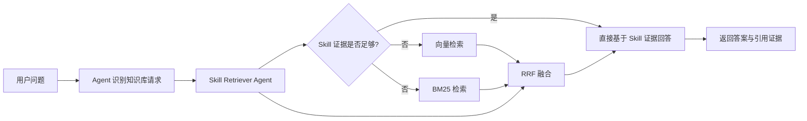

# SkillRAG

面向本地运行、文件优先、可审计的 **Skill-First Hybrid RAG** 智能体工作台。

> **SkillRAG** 的设计受 Claude Code 启发：技能（Skill）以可读的 Markdown 文件定义，知识索引采用**按需加载（Lazy Loading）**策略——启动时仅建立轻量元信息索引，向量索引在首次检索时延迟构建，兼顾快速启动与完整检索能力。

核心思想很简单：让 Agent 的每一个行为——思考、检索、工具调用——都**可读、可改、可审计**。

- 对话记录 / 工具调用 / 检索过程全部落到本地文件
- 长期记忆是可直接编辑的 Markdown 文档
- 技能不是黑盒函数，而是 `skills/*/SKILL.md`——人可以读，也可以改
- 前端直观展示流式回复、工具链路、检索证据，Agent 的每一步都有据可查

如果你想构建一个"能解释自己为什么这样回答"的 Agent，这个仓库就是为这种场景准备的。

---

## 核心特性

- **本地优先**：后端 + 前端均可本地启动，零外部依赖（无 MySQL / Redis）
- **文件即事实源**：`memory/`、`workspace/`、`knowledge/` 均为可见、可改、可版本管理的文件
- **Prompt 可解释**：系统提示词由多个 Markdown 文件实时组装
- **技能可审计**：每个技能对应 `skills/*/SKILL.md`，Agent 推理链路透明
- **检索可观测**：前端展示检索步骤、证据来源、工具调用全链路
- **Claude Code 式索引**：索引按需加载，首次请求时延迟构建，启动时间与内存占用更优
- **Skill 优先**：知识检索先走技能匹配，证据不足时自动回退到混合检索

## 当前能力

- FastAPI + SSE 流式聊天
- 会话持久化到 `backend/sessions/*.json`
- 长期记忆文件：`backend/memory/MEMORY.md`
- 可切换的记忆 RAG 模式
- 本地知识库检索
- 前端三栏工作台
- 在线编辑 Memory / Skills / Workspace 文件
- 检索证据、工具调用、Raw Messages 可视化

当前内置技能包括：

| 技能 | 说明 |
|------|------|
| `rag-skill` | 本地知识库检索 |
| `web-search` | 联网搜索（Tavily） |
| `get_weather` | 天气查询 |
| `retry-lesson-capture` | 失败经验沉淀 |

## 知识库目录说明

仓库自带示例知识库，位于 `backend/knowledge/`。包含：

- FAQ / Markdown / JSON 示例数据
- PDF / Excel 等异构知识文件
- 顶层和子目录的 `data_structure.md`

你可以直接使用已有知识文件做体验，也可以持续向该目录补充自己的资料。

## 知识库检索链路

这是项目的核心设计——**Skill 优先，混合检索兜底**。

### 检索流程



### 索引策略

采用**按需加载（Lazy Loading）**策略，类似 Claude Code 的索引方式：

1. **启动时**：加载已缓存的 manifest 元信息，BM25 统计就绪
2. **向量索引**：优先从本地存储加载；若无缓存，在首次检索时自动构建
3. **重建触发**：知识文件变更后，通过 API 手动触发完整重建

这种设计让启动时间维持在毫秒级别，且不占用 Embedding API 配额，适合本地开发与迭代场景。

### 当前实现范围

- Skill 检索始终优先执行
- 当结果为 `partial / not_found / uncertain` 时，触发混合检索兜底
- 混合检索由 向量检索 + BM25 检索 + RRF 融合 组成
- 当前索引主要覆盖 `knowledge/` 中的 `.md` 和 `.json`
- Excel / PDF 仍主要依赖 `rag-skill` 的专门处理流程

### 相关代码

| 模块 | 文件 | 职责 |
|------|------|------|
| 后端入口 | [backend/app.py](backend/app.py) | FastAPI 启动、生命周期管理、索引初始化 |
| Agent 主入口 | [backend/graph/agent.py](backend/graph/agent.py) | LangChain Agent 编排 |
| 知识检索编排 | [backend/knowledge_retrieval/orchestrator.py](backend/knowledge_retrieval/orchestrator.py) | Skill → Hybrid 路由 |
| 向量/BM25 索引 | [backend/knowledge_retrieval/indexer.py](backend/knowledge_retrieval/indexer.py) | 索引构建、持久化、按需加载 |
| 混合检索 | [backend/knowledge_retrieval/hybrid_retriever.py](backend/knowledge_retrieval/hybrid_retriever.py) | 向量 + BM25 双通道 |
| 技能检索代理 | [backend/knowledge_retrieval/skill_retriever_agent.py](backend/knowledge_retrieval/skill_retriever_agent.py) | Skill 匹配与证据评估 |

## 系统结构

```text
SkillRAG/
├── backend/
│   ├── api/                       # Chat、Session、File、Token、Knowledge Index 接口
│   ├── graph/                     # Agent 编排、Prompt 组装、Session 管理
│   ├── knowledge/                 # 仓库内置示例知识库
│   ├── knowledge_retrieval/       # Skill 优先 + Hybrid Fallback 检索链路
│   ├── memory/                    # 长期记忆文件
│   ├── scripts/                   # 评测与辅助脚本
│   ├── sessions/                  # 会话历史 JSON
│   ├── skills/                    # 技能目录，每个技能核心是 SKILL.md
│   ├── storage/                   # 索引缓存、评测产物
│   ├── tools/                     # Shell / Read File / Python REPL / Fetch URL 工具
│   ├── workspace/                 # SOUL / USER / AGENTS 等系统上下文组件
│   └── app.py                     # FastAPI 入口
├── frontend/
│   ├── src/app/                   # 页面入口
│   ├── src/components/            # 聊天面板、检索面板、编辑器等 UI
│   └── src/lib/                   # API 客户端与状态管理
└── README.md
```

### [架构图](docs/architecture-flowchart.html)


## 技术栈

### 后端

- Python 3.10+
- FastAPI + Uvicorn
- LangChain 1.x
- LlamaIndex
- OpenAI-compatible Model API
- Ragas（离线评估）

### 前端

- Next.js 14
- React 18 + TypeScript
- Tailwind CSS
- Monaco Editor

## 默认模型配置

详见 [backend/config.py](backend/config.py)：

- **代码层默认**：LLM → `zhipu` / `glm-5`，Embedding → `bailian` / `text-embedding-v4`
- **环境文件默认**（`backend/.env.example`）：LLM 与 Embedding 均为 `zhipu`

支持 Provider：`zhipu`、`bailian`、`deepseek`、`openai`

## 环境变量

示例文件见 [backend/.env.example](backend/.env.example)。

读取顺序：`backend/.env` → 系统环境变量

最少配置：

```env
LLM_PROVIDER=zhipu
LLM_MODEL=glm-5
ZHIPU_API_KEY=your_key

EMBEDDING_PROVIDER=zhipu
EMBEDDING_MODEL=embedding-3
EMBEDDING_API_KEY=your_key

TAVILY_API_KEY=your_key
```

## 快速开始

### 1. 启动后端

```bash
cd backend
python -m venv .venv
source .venv/bin/activate        # Windows: .venv\Scripts\activate
pip install -r requirements.txt
cp .env.example .env             # 编辑 .env 填入 API Key
 app:app --host 127.0.0.1 --port 8004 --reload
```

健康检查：`http://127.0.0.1:8004/health`

### 2. 启动前端

```bash
cd frontend
npm install
npm run dev
```

前端默认地址：`http://127.0.0.1:3000`，请求后端 `http://127.0.0.1:8004/api`。

如需自定义后端地址：

```bash
export NEXT_PUBLIC_API_BASE_URL="http://127.0.0.1:8010/api"
```

## 5 分钟体验路径

1. 启动前后端，发送一条普通聊天消息，确认流式输出正常
2. 打开右侧 Inspector，查看工具调用和 Raw Messages
3. 编辑 `backend/memory/MEMORY.md`，观察记忆生效
4. 提一个知识库问题，观察 Skill 检索和 Fallback 检索链路
5. 查看 `backend/sessions/*.json`，确认消息、工具调用、检索记录已落盘

## 评测脚本

FAQ 检索评测脚本位于 `backend/scripts/`，产物写入 `backend/storage/eval_outputs/`。

适用场景：
- 路由命中率评测
- FAQ 检索准确率评测
- Ragas 指标评测

## 当前边界

- 更适合本地开发和研究，非生产 SaaS
- Excel / PDF 的高级处理仍主要依赖技能链路
- 混合检索当前主要覆盖 Markdown / JSON 类知识文件
- 技能和知识链路仍在快速迭代中

## 致谢

Skill 设计思路参考了 [ConardLi/rag-skill](https://github.com/ConardLi/rag-skill)。
